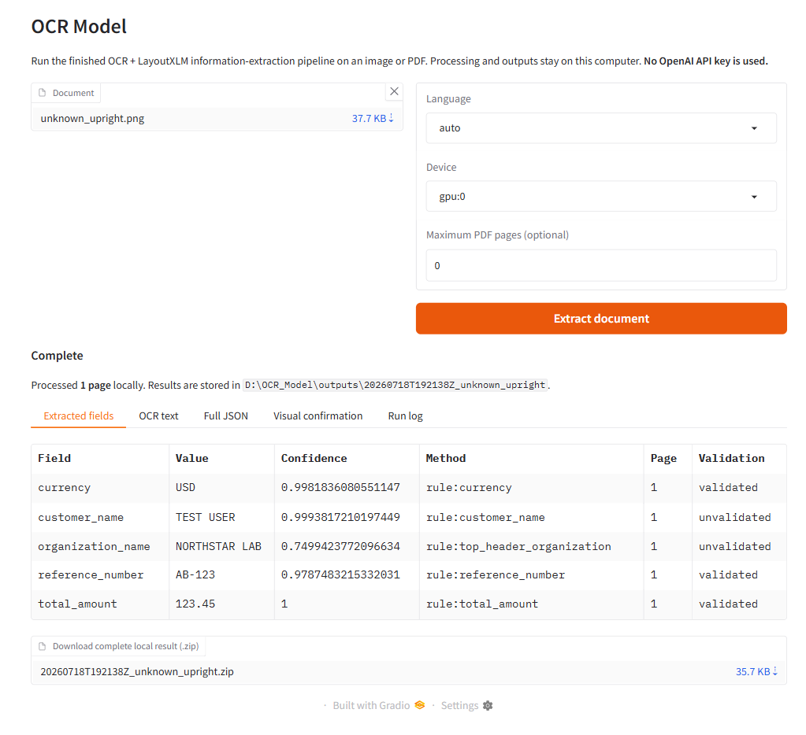

# OCR Model: Local Document Intelligence

Turn images and PDFs into structured, reviewable data on your own computer.
OCR Model combines PaddleOCR, a fine-tuned LayoutXLM checkpoint, evidence-based
field extraction, and schema validation behind a one-command CLI and local web
GUI. Extraction uses no OpenAI API key and does not upload the document.

[Watch the 2:54 demo](https://youtu.be/8BV8LnbK1GI) ·
[View the OpenAI Build Week submission](https://devpost.com/software/ocr-model-local-document-intelligence) ·
[Download the portable release](https://github.com/PracticalSwan/csx4201-vision-info-extraction/releases/tag/v1.0.0-build-week) ·
[Read the model card](reports/final_model/final_model_card.md)



## What it does

For an uploaded image or PDF, the local pipeline:

- previews the image or first PDF page before extraction;
- evaluates document orientation and fine deskew evidence;
- routes general and Thai text through pinned PaddleOCR models;
- predicts entities, document type, canonical fields, and typed relations with
  a fine-tuned LayoutXLM checkpoint;
- adds generic key/value relations, evidence checks, and table geometry;
- validates the result against a versioned JSON Schema; and
- writes JSON, page overlays, OCR artifacts, logs, and a downloadable ZIP.

The GUI has one progress indicator and independently scrollable OCR-text and
run-log panes. The preserved four-cluster rotation experiment contributes a
display-only quadrant; it never controls OCR or extraction.

## Try it

The weights-included Release is the simplest route. It contains the trained
LayoutXLM checkpoint, three pinned PaddleOCR model directories, a safe
synthetic sample, manifests, and launchers. It does not contain raw training
data, private documents, credentials, or previous user outputs.

### Windows

Requirements: 64-bit Windows 10/11, Python 3.10 from python.org, internet
access for the one-time dependency install, and approximately 20 GB of free
disk space.

1. Download `OCR_Model.zip` and its `.sha256` sidecar from the
   [Release](https://github.com/PracticalSwan/csx4201-vision-info-extraction/releases/tag/v1.0.0-build-week).
2. Extract the ZIP to a normal writable folder.
3. Run `setup_windows.bat` once.
4. Run `launch_windows.bat`, select a document, and choose **Extract
   document**.

After setup, the same pipeline runs from one command:

```powershell
.\run_cli.bat "C:\path\to\document.pdf"
```

The default recipient setup is CPU-only. A compatible NVIDIA GPU is optional.

### macOS

The supported macOS route is a CPU-only `linux/amd64` container through Docker
Desktop:

```bash
cd /path/to/OCR_Model
bash launch_macos.command
```

Then open <http://127.0.0.1:7860>. This image was built and exercised on
Windows Docker Desktop, with output parity against the native Windows run. No
physical Intel or Apple Silicon Mac was available, so the host-specific launch
remains untested and may be slow under emulation.

See the [portable usage guide](docs/PORTABLE_USAGE.md) for diagnostics,
troubleshooting, output details, and the exact package checksum.

## Local development

The source checkout expects the model environments and large assets described
in [the OCR setup guide](docs/ocr_setup.md). On the verified development
machine:

```powershell
python run_ocr.py "path\to\document.pdf"
python app.py
```

The lower-level entry point provides language, device, page-limit, confidence,
visualization, and private-output controls:

```powershell
python scripts/extract_document.py --help
```

Every completed run is schema-validated against
[`schemas/inference_output.schema.json`](schemas/inference_output.schema.json).
Unsupported or conflicting fields remain `null`; emitted values include
confidence, evidence, validation status, and extraction source.

## How it works

```text
image / PDF
  -> page, color, transparency, and EXIF normalization
  -> orientation candidates + reliable fine deskew
  -> PP-OCRv6 detector
  -> general PP-OCRv6 or Thai PP-OCRv5 recognizer
  -> persistent LayoutXLM multitask worker
       entity | document type | canonical evidence | relation heads
  -> calibrated abstention + evidence and arithmetic checks
  -> generic key/value fallback + geometry tables
  -> JSON Schema validation + atomic output

same page -> PCA/K-Means rotation quadrant -> display only
```

Paddle and CUDA PyTorch use separate Python 3.10 environments on Windows to
avoid conflicting cuDNN libraries. The LayoutXLM encoder starts from
`microsoft/layoutxlm-base`; the incompatible Detectron2 visual backbone is not
used.

## Verified results

These measurements describe different stages and should not be substituted for
one another:

| Evaluation | Result |
|---|---:|
| Public reference-token entity F1 | 0.9813 |
| Public reference-token canonical-evidence F1 | 0.9814 |
| Public reference-token relation F1 | 0.4632 |
| 18-angle layout grid minimum entity F1 | 0.7491 |
| Bounded end-to-end entity F1 with real OCR | 0.1314–0.1830 |
| Fixed unseen CORU OCR answer-string recall | 78.53% |
| Private local operational run | 26/26 documents, 203/203 pages completed |

The final four-epoch model used 7,782 public training examples. The exact
`model.safetensors` SHA-256 is
`34c7a26e78d6285a2739e1b61839eadfd0e686ccbcf57f9cb47997c12cef2189`.
The IE verifier completed 46/46 checks. The host suite previously completed
243 tests with two environment-dependent skips, and Windows GPU and Docker CPU
extractions matched on the safe validation document.

Full evidence is under [`reports/final_model`](reports/final_model), including
the [error analysis](reports/final_model/error_analysis.md). Reference-token
scores isolate the layout model; end-to-end scores include OCR errors.

## OpenAI Build Week extension

The OCR/layout model and its research evaluation existed before OpenAI Build
Week. Work completed for the event added:

- a relocatable weights-included package;
- one-command CLI and local GUI;
- native Windows setup and a Docker-backed macOS route;
- model and privacy manifests;
- the consent-gated `$review-ocr-document` Codex skill; and
- a local STDIO MCP bridge for bounded GPT-5.6 review.

The optional review bridge uses the user's signed-in Codex session, not an API
key. It exposes opaque result IDs, asks the user to select fields, and requires
separate confirmation before any OCR text is shared. GPT-5.6 returns
suggestions without changing the authoritative local JSON. It is optional;
local extraction works without it.

See the [Build Week changelog](docs/devpost/BUILD_WEEK_CHANGELOG.md) and
[Codex integration guide](docs/CODEX_INTEGRATION.md).

## Privacy and limitations

- Raw and private Gmail-sourced documents are excluded from Git and the
  portable package.
- Private operational evaluation is reported only in aggregate; public reports
  contain no filenames, document text, images, or per-document predictions.
- End-to-end OCR is the main accuracy bottleneck.
- Relation learning is limited by FUNSD-only supervision.
- No compatible labeled public Thai benchmark was available; Thai validation
  is synthetic and integration-focused.
- The K-Means quadrant is diagnostic only, and the failed exact-angle estimator
  is disabled.
- This is an academic prototype. Human verification is required for legal,
  financial, medical, or other consequential use.

More detail is available in the [privacy guide](docs/privacy.md),
[evaluation guide](docs/evaluation.md), and
[requirements](docs/requirements.md).

## Project layout

```text
src/          OCR, layout, inference, evaluation, and portable application code
scripts/      setup, training, evaluation, verification, and release commands
schemas/      versioned inference-output JSON Schema
models/       small calibration and display-only rotation artifacts
reports/      public metrics, provenance, model card, and error analysis
tests/        synthetic and regression tests
docs/         setup, architecture, privacy, portable, and submission guides
```

Large model assets, derived caches, raw data, and private outputs are
deliberately excluded from the repository.

## Contributing

This is a solo academic project maintained by Sithu Win San. Issues and pull
requests are welcome, but the project is not adding collaborators,
co-maintainers, or team members. Read [CONTRIBUTING.md](CONTRIBUTING.md) before
opening a pull request, especially the privacy and test requirements.

## License

Original source code and documentation authored for this project are licensed
under the [MIT License](LICENSE), copyright 2026 Sithu Win San.

Trained weights, datasets, and third-party components retain their upstream
licenses. The LayoutXLM-derived checkpoint is distributed under
[CC BY-NC-SA 4.0](https://creativecommons.org/licenses/by-nc-sa/4.0/) and is
restricted to noncommercial use. Review
[THIRD_PARTY_NOTICES.md](docs/THIRD_PARTY_NOTICES.md) before redistribution.
